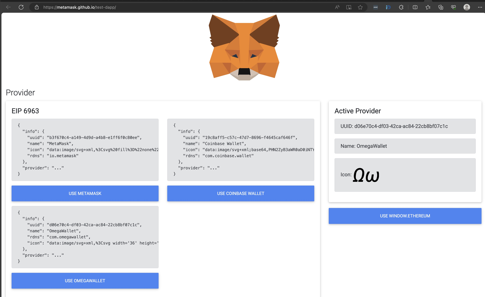
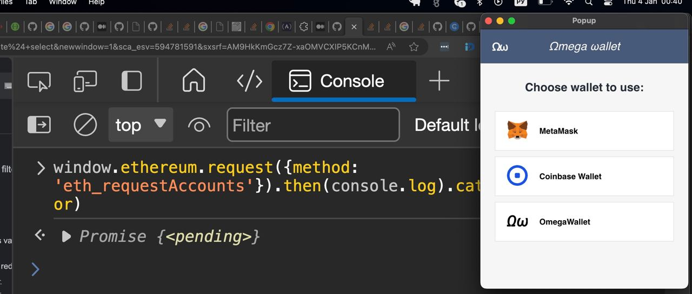
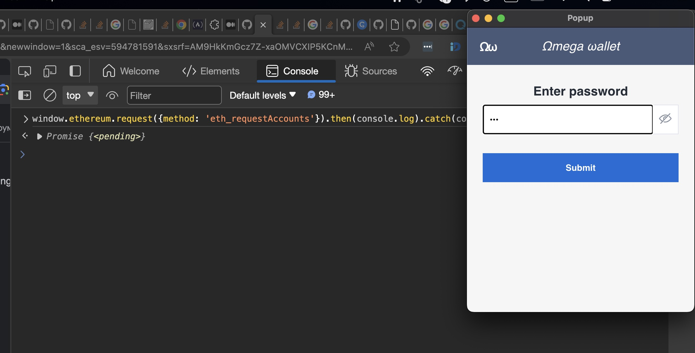

  

 

  

<h1> OmegaWallet implementation with Chrome Extension Boilerplate with React + Vite + TypeScript</h1>

 

  

  

  

## Table of Contents

  

- [Intro](#intro)

- [Installation](#installation)

- [Procedures](#procedures)

- [Run](#Run)

- [Whats implemented](#Whats_implemented)
- [Whats not](#Whats_not)

  

## Installation 

  

  

## Procedures: 

  

  

1. Clone this repository.

  

2. Change `name` and `description` in package.json => **Auto synchronize with manifest**

  

3. Install pnpm globally: `npm install -g pnpm` (it didn't work for me on v16, v18 works well)

  

4. Run `pnpm install`

  

  

## Run: 

it set up to work with local netwok like hardhat or ganache. Ganache used by default

  

  

1. Run:

-  `pnpm start` or `npm run start` that will run build and will start ganache

  

- Alternatively: `pnpm build` or `npm run build` if you don't want start ganache

  

2. Open in browser - `chrome://extensions`

  

3. Check - `Developer mode`

  

4. Find and Click - `Load unpacked extension`

  

5. Select - `dist` folder

## Whats implemented 

 -- EIP-6963 provider discovery
 -- 
 
 -- Prompt to choose provider for multi-wallet users
 --
 
 -- Private key password protection (inmemory session storage)
 --
  
  
## What's not implemented
-- ehh_sendTransaction and related user interaction with approval 
--
Had no time to implement that feature at the moment of submission. That would take 1-2 days more
-- Tests
--
had no time for tests at the moment of submission. Code been written with tests in mind. Almost all components easily testable or mockable: Epics are pure functions and easy to test. UI decoupled from logic via redux. Basically all it does - dispatches actions. Dependencies injected into epics. Sure, tests will raise some problems, but, as I already said, had no time for tests at the moment of submission